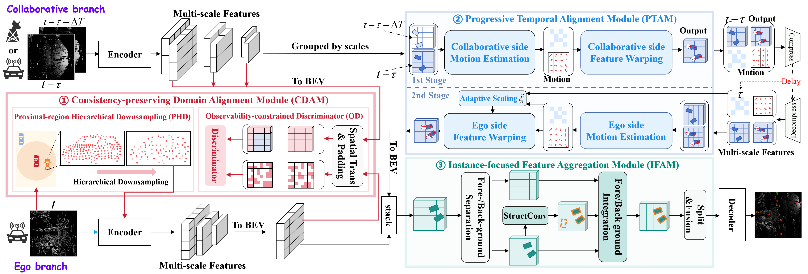
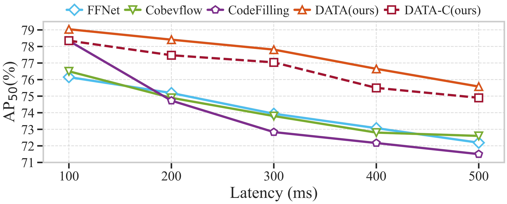

# DATA: Domain-And-Time Alignment for High-Quality Feature Fusion in Collaborative Perception

[](https://arxiv.org/abs/2507.18237)
[](https://arxiv.org/pdf/2507.18237.pdf)


## Abstract

Feature-level fusion shows promise in collaborative perception (CP) through balanced performance and communication bandwidth trade-off. However, its effectiveness critically relies on input feature quality. The acquisition of high-quality features faces domain gaps from hardware diversity and deployment conditions, alongside temporal misalignment from transmission delays. These challenges degrade feature quality with cumulative effects throughout the collaborative network. In this paper, we present the Domain-And-Time Alignment (DATA) network, designed to systematically align features while maximizing their semantic representations for fusion. Specifically, we propose a Consistency-preserving Domain Alignment Module (CDAM) that reduces domain gaps through proximal-region hierarchical downsampling and observability-constrained discriminator. We further propose a Progressive Temporal Alignment Module (PTAM) to handle transmission delays via multi-scale motion modeling and two-stage compensation. Building upon the aligned features, an Instance-focused Feature Aggregation Module (IFAM) is developed to enhance semantic representations. Extensive experiments demonstrate that DATA achieves state-of-the-art performance on three typical datasets, maintaining robustness with severe communication delays and pose errors.

## Method Overview

<div align="center">
  
  <p><em>Overview of DATA framework. The network consists of three main modules: (i) CDAM for domain alignment during training, (ii) PTAM for temporal alignment during both training and testing, and (iii) IFAM for feature aggregation and fusion.</em></p>
</div>

## Quantitative Results

### Performance Comparison on Three Datasets

| Method | DAIR-V2X-C (AP₅₀/AP₇₀) | V2XSim (AP₅₀/AP₇₀) | V2XSet (AP₅₀/AP₇₀) |
|--------|-------------------------|--------------------|--------------------|
| DiscoNet (NeurIPS'21) | 68.50/53.57 | 83.56/66.12 | 82.34/64.79 |
| Where2comm (NeurIPS'22) | 68.39/52.48 | 83.82/65.52 | 85.19/61.59 |
| FFNet (NeurIPS'23) | 77.19/60.17 | 85.56/68.64 | 83.57/66.23 |
| HEAL (ICLR'24) | 79.00/63.12 | 88.67/75.85 | 88.40/72.13 |
| **DATA (Ours)** | **79.94/65.48** | **88.91/77.69** | **89.53/74.98** |

### Robustness to Communication Delays

<div align="center">
  
  <p><em>Performance with communication latency on DAIR-V2X-C dataset. DATA maintains superior performance under various delay conditions.</em></p>
</div>

## Implementation

**Code and environment setup are being organized and will be released progressively.**

## Citation

If you find our work useful in your research, please consider citing:

```bibtex
@article{tian2025data,
  title={DATA: Domain-And-Time Alignment for High-Quality Feature Fusion in Collaborative Perception},
  author={Tian, Chengchang and Ma, Jianwei and Huang, Yan and Chen, Zhanye and Wei, Honghao and Zhang, Hui and Hong, Wei},
  journal={arXiv preprint arXiv:2507.18237},
  year={2025}
}
```
